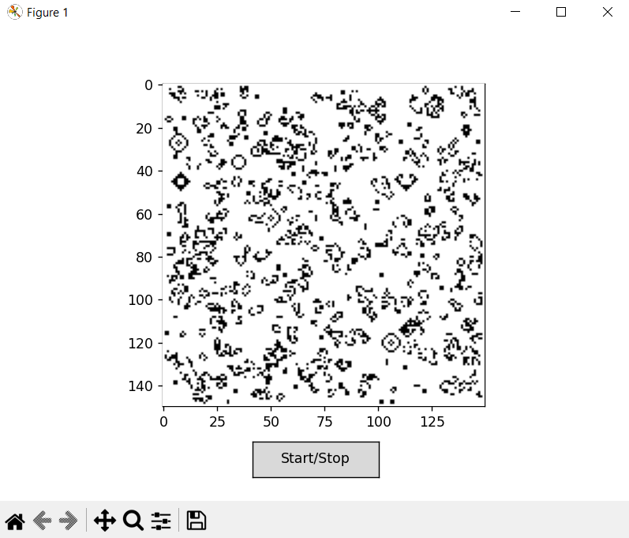

# Game of Life

A Python implementation of Conway's Game of Life, a zero-player cellular automaton where cells on a grid live, die, or reproduce based on simple rules. This version includes random initial states, optional predefined life forms, and an interactive start/stop animation button.


## Features

- Grid size configurable by the user.
- Random initial states with optional predefined life forms (like gliders, blinkers, etc.).
- Interactive animation with a Start/Stop button.
- Border conditions: edges of the grid are always dead.
- Matplotlib visualization with real-time updates.

## Rules

The simulation follows the classic Game of Life rules:

- Any live cell with 2 or 3 live neighbors survives.
- Any dead cell with exactly 3 live neighbors becomes alive.
- All other cells die or remain dead in the next generation.

## Run

```
python game_of_life.py
```
