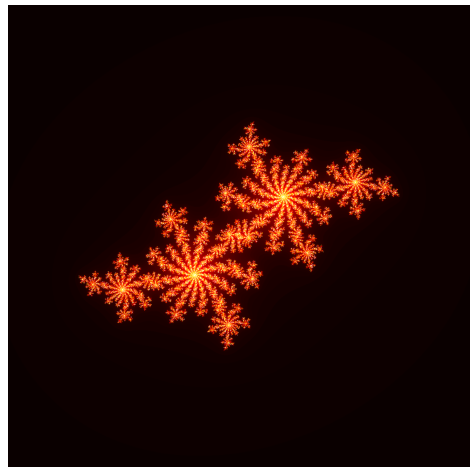

# Mandelbrot Fractal Generator

A Python program to visualize Mandelbrot-type fractals for a fixed complex parameter \(c\).  
Generates iteration-based fractals using NumPy and visualizes them with Matplotlib.

## Formula

The fractal is generated using the recurrence:

$$
z_{n+1} = z_n^2 + c
$$

Where:

- \(z_n\) is the current complex number.
- \(c = cx + i \cdot cy\) is the chosen complex parameter.
- Iterations continue until \(|z_n| > 4\) or a maximum iteration count is reached.

## Features

- Generate 2D iteration grids for Mandelbrot-type fractals.
- Adjustable grid resolution (`n_rows`, `n_columns`).
- Configurable maximum iterations per point.
- Choose complex parameter `c = cx + cy*i`.
- Display the fractal using a heatmap.
