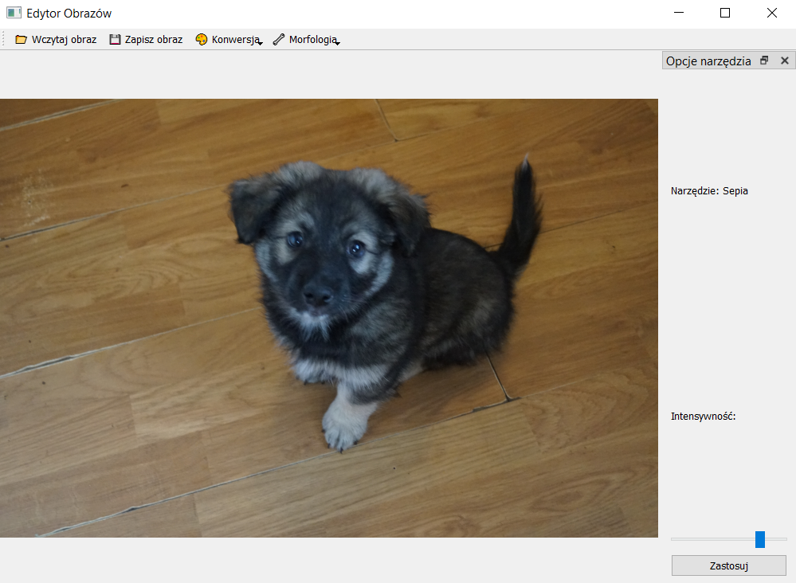
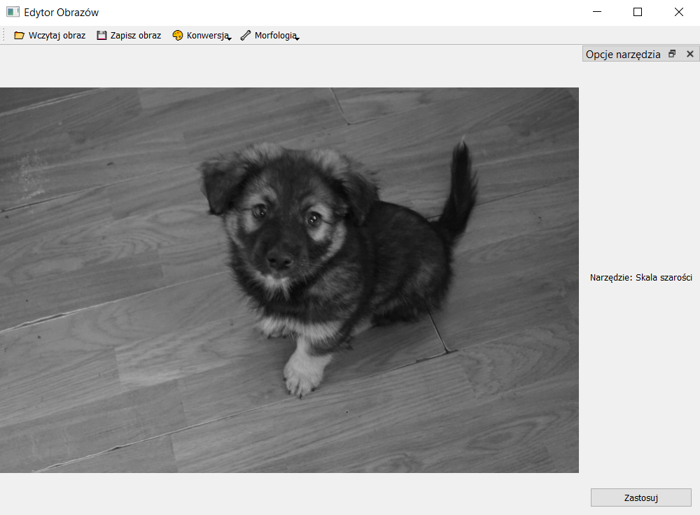
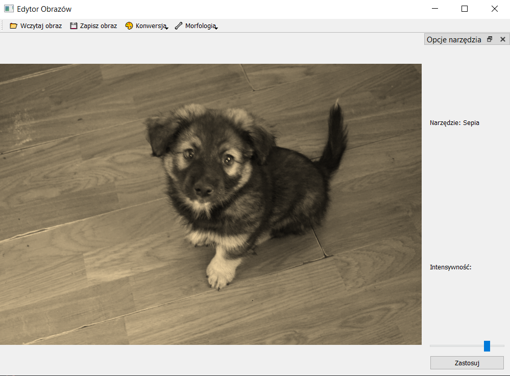
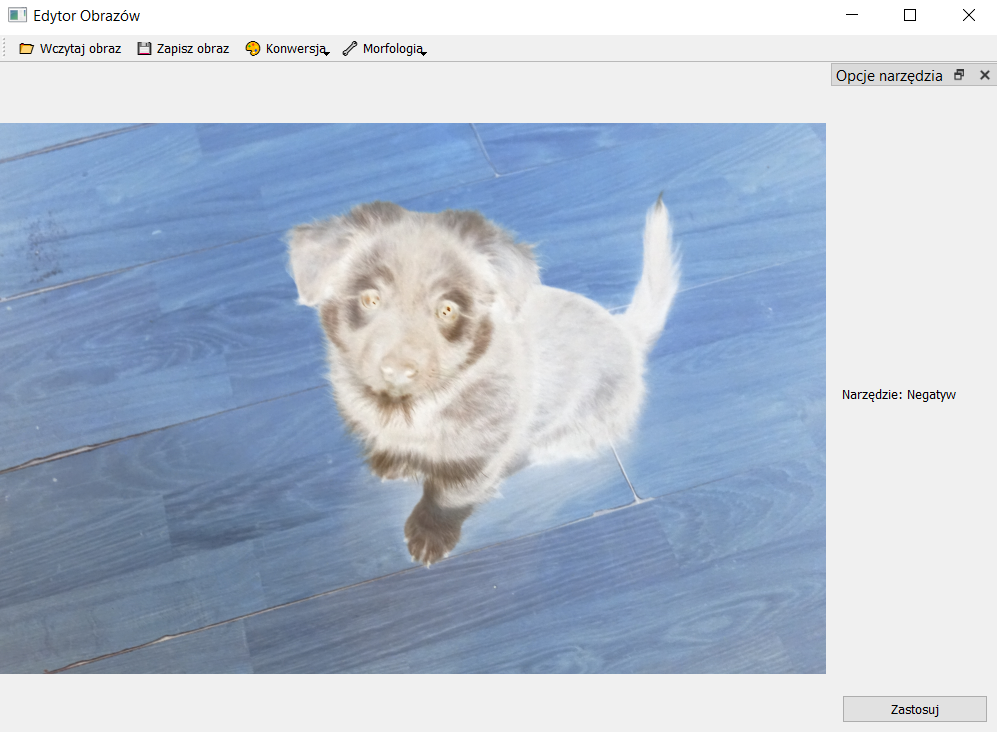
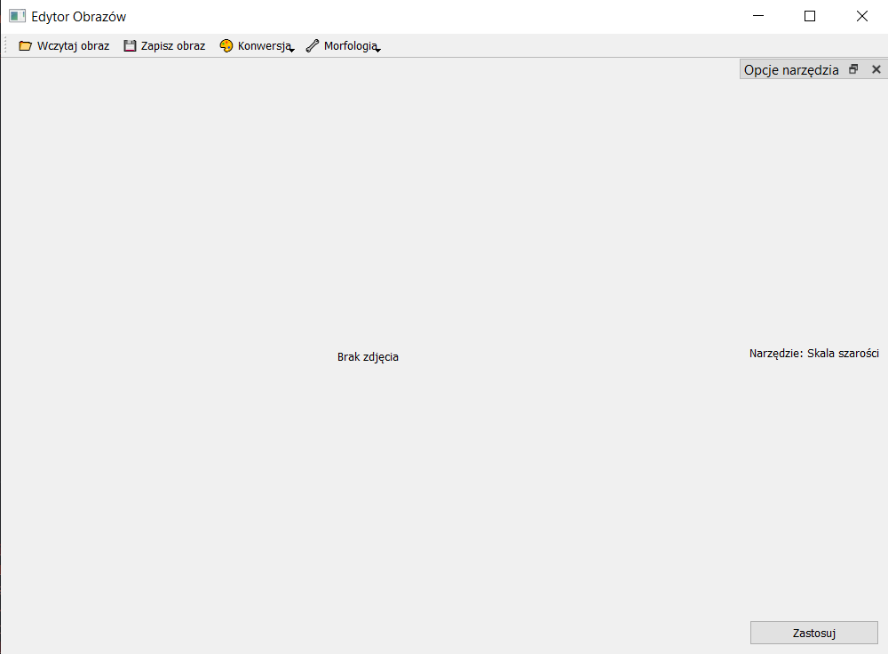

# Photo Lab

A Python-based image editing application built with PyQt5 and OpenCV.
Currently supports palette conversions (grayscale, sepia, negative), with plans to add morphology filters and histogram equalization in the future.

## Features

- Load and display images (.png, .jpg, .jpeg, .bmp).
  
- Apply palette transformations:
  - Grayscale
    
  - Sepia (with adjustable intensity)
    
  - Negative
    
- Interactive GUI with side panels for tool options.
- Drag-and-drop support for images.
- Save edited images in various formats.
- Future updates planned: morphology filters, histogram equalization.

## GUI Overview



Toolbar:

- Load Image 📂
- Save Image 💾
- Palette Conversion 🎨
- Morphology Tools 🔧
  Side Panel: Shows options for the selected tool (e.g., sepia intensity).

## Run

```
python main.py
```
