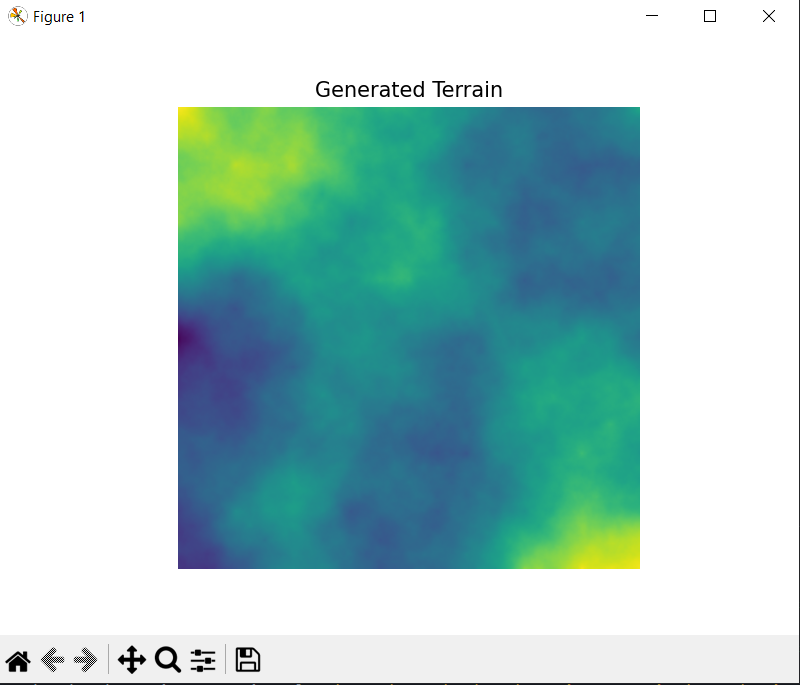

# Terrain Generation

A Python program for procedural terrain generation using the Diamond-Square algorithm.
Generates realistic 2D heightmaps and visualizes them using Matplotlib.


## Features

- Diamond-Square algorithm implementation for fractal terrain generation.
- Adjustable grid size (must be 2^n + 1, e.g. 513, 1025).
- 2D grayscale visualization of the terrain.
- Modular design for future enhancements, including terrain scaling, 3D visualization, and exporting terrain maps.

## Run

```
python main.py
```

## Algorithm Overview

- Diamond-Square is a fractal-based terrain generation algorithm:
- Initialization: Corners of the grid are assigned random values.
- Diamond Step: For each square in the grid, calculate the midpoint using the average of its corners plus a random offset.
- Square Step: For each diamond in the grid, calculate the center using the average of surrounding points plus a random offset.
- Iteration: Reduce step size by half and repeat until the grid is fully populated.
